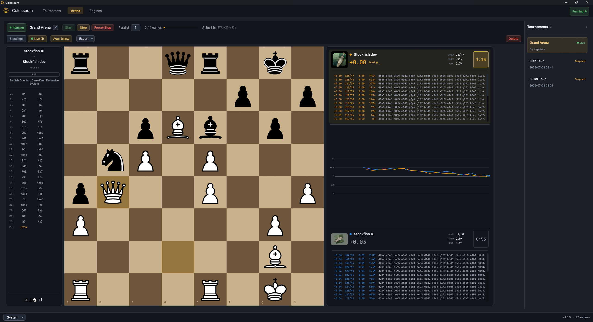

<p align="center">
  
</p>

<h1 align="center">Colosseum</h1>

<p align="center">
  Run, watch and rigorously test ordinary UCI chess engines.
</p>

> **Colosseum GUI 1.0.2 · Colosseum CLI 0.1.0 · Windows · Linux · macOS · GPL-3.0-or-later**

---

## Two independent tools

| Product | Best for | Highlights |
|---|---|---|
| **Colosseum GUI** (`colosseum`) | Interactive engine tournaments | Live boards, round robins and gauntlets, ratings with error bars, engine library, PGN and CSV export |
| **Colosseum CLI** (`colosseum-cli`) | Reproducible chess-engine development testing | Fixed matches, pair-atomic SPRT, SPSA, calibration, NPS/scaling, suites, tournaments, book utilities and statistics replay |

Both products launch ordinary [Universal Chess Interface (UCI)](https://www.shredderchess.com/chess-info/features/uci-universal-chess-interface.html)
executables as separate processes. Engines need no Colosseum manifest, custom
build command or source-tree integration. The GUI and CLI share tested engine
infrastructure but have independent versions, binaries, configuration and
release artifacts.

---

## Colosseum GUI

Use the desktop application to play many games concurrently and watch them
live. It detects engine options, supports opening books, adjudication,
tablebases and pondering, persists every finished game, and can resume an
interrupted tournament.



### Download and install

Download the current GUI from the
[Colosseum 1.0.2 release](https://github.com/maelic13/colosseum/releases/tag/v1.0.2).
Future GUI releases use `gui-v…` tags; the complete history is on the
[releases page](https://github.com/maelic13/colosseum/releases).

### Windows

| Your PC | File | How to install |
|---|---|---|
| Intel or AMD | `…-windows-x86_64.msi` | Double-click, then follow the installer |
| Arm (Snapdragon) | `…-windows-arm64.msi` | Double-click, then follow the installer |
| No install wanted | `…-windows-….zip` | Unzip and run `colosseum.exe` |

### Linux (64-bit)

| Your distribution | File | How to install |
|---|---|---|
| Ubuntu, Debian, Mint, Pop!_OS | `….deb` | `sudo apt install ./colosseum-….deb` |
| Fedora, RHEL, openSUSE | `….rpm` | `sudo dnf install ./colosseum-….rpm` |
| Arch, CachyOS, EndeavourOS, Manjaro | `….pkg.tar.zst` | `sudo pacman -U ./colosseum-….pkg.tar.zst` |
| Anything else | `….tar.gz` | Extract and run `./colosseum` |

### macOS (Apple Silicon)

Download `…-macos-aarch64.dmg`, open it, and drag Colosseum to Applications.
Intel Macs are not supported.

The app is not signed yet, so macOS blocks it on first launch. Open
**System Settings → Privacy & Security** and click **Open Anyway**.

---

### Getting started

1. **Engines tab** — click *Add Engine* and pick an engine executable
   (or *Scan Folder* to add many at once). Set a starting Elo if you know it.
2. **Tournament tab** — tick the engines you want, choose a format and time
   control, then hit *Start Tournament*.
3. **Arena tab** — watch the standings fill in, or switch to *Live* to follow
   a game move by move.

Tips:

- Keep **Parallel games** at or below your CPU core count — engines that share
  cores lose on time.
- **Update ratings** decides whose library Elo the tournament changes. Testing
  one new engine? Set it to *Chosen engines* and pick only that one.
- Stopped a tournament? Select it in the Arena list and press *Start* to
  continue where it left off.

---

### Where the GUI stores files

| | Windows | Linux | macOS |
|---|---|---|---|
| Settings & engines | `%APPDATA%\Colosseum\` | `~/.config/colosseum/` | `~/Library/Application Support/Colosseum/` |
| Games & logs | `%APPDATA%\Colosseum\` | `~/.local/share/colosseum/` | `~/Library/Application Support/Colosseum/` |

Start Colosseum with `--portable` to keep everything next to the program instead.

---

## Colosseum CLI for UCI chess engines

The headless CLI is designed for committed, repeatable experiments. It records
resolved inputs, seeds, capabilities, games, checkpoints and statistics in a
self-contained run directory; failures and non-conforming engine behavior stay
visible in machine-readable results.

Download the archive for your platform from the
[Colosseum CLI 0.1.0 release](https://github.com/maelic13/colosseum/releases/tag/cli-v0.1.0),
extract it and run `colosseum-cli --help` or `colosseum-cli self-test`.
The archives include the complete offline CLI guide.

To build from source instead, install Rust 1.88 or newer and run:

```text
git clone https://github.com/maelic13/colosseum.git
cd colosseum
cargo build --release -p colosseum-cli --bin colosseum-cli
./target/release/colosseum-cli --help
./target/release/colosseum-cli self-test
```

On Windows, use `target\release\colosseum-cli.exe`. A first experiment can
inspect two engines and run a fixed match without an opening book:

```text
colosseum-cli engine check ./candidate
colosseum-cli engine check ./baseline
colosseum-cli match ./candidate ./baseline --games 100 --a-movetime-ms 100 --b-movetime-ms 100
```

Run directories are created under `./colosseum-runs/` by default. Pass
`--dir <path>` to a durable workflow when an experiment should live at an
explicit path or be resumed there.

Start with the concise [CLI overview](README-CLI.md) or go directly to the
[complete CLI guide](docs/cli/README.md). Consult the
[CLI changelog](CHANGELOG-CLI.md) for release history. Portable archives and
independently versioned `cli-v…` releases are available on the
[releases page](https://github.com/maelic13/colosseum/releases).

---

## Help and project links

- Something broken or missing? [Open an issue](https://github.com/maelic13/colosseum/issues).
- Product release histories: [GUI changelog](CHANGELOG-GUI.md) ·
  [CLI changelog](CHANGELOG-CLI.md)
- Building, testing and releasing from source: [development guide](docs/DEVELOPMENT.md)

---

## Credits & license

Chess pieces by Colin M.L. Burnett ([cburnett](https://github.com/lichess-org/lila/tree/master/public/piece/cburnett),
CC BY-SA 3.0) · opening names from [lichess chess-openings](https://github.com/lichess-org/chess-openings)
(CC0) · fonts [Inter](https://rsms.me/inter/) and [JetBrains Mono](https://www.jetbrains.com/lp/mono/)
(SIL OFL 1.1).

Colosseum is free software under the **GNU General Public License v3.0 or
later** — see [LICENSE](LICENSE).
Copyright © 2026 Miloslav Macůrek.
