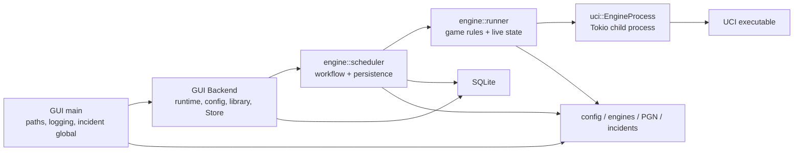

# Current-state architecture

This document is the evidence and analysis artifact for GUIDE step 0.2. It
evaluates the repository at baseline
`6f6e864599122ef15b5d0942b4037c41c28bd557` against the binding Clean
Architecture and independence rules in
PLAN §S4. The factual package/module inventory is in
[`dependency-inventory.md`](dependency-inventory.md).

This is deliberately a current-state report. It identifies responsibilities,
boundaries and violations; step 0.3 chooses the target architecture and
migration map.

## Executive assessment

The repository has a useful inward **Cargo package graph**:

```text
colosseum-gui → colosseum-engine → colosseum-uci → colosseum-core
       └──────────────→ colosseum-core ←──────────┘
```

No headless crate depends on the GUI, and most mathematical logic in
`colosseum-core` is already deterministic and reusable. The UCI protocol and
game-playing code are substantial working assets.

The package names do not yet represent Clean Architecture layers, however:

- There is no application/use-case layer or port boundary.
- `colosseum-core` mixes reusable domain logic with GUI-library data,
  presentation events, product branding, paths and random ID generation.
- `colosseum-engine` mixes application workflows, GUI read models, concrete
  UCI processes, SQLite, filesystem artifacts, application directories and
  global incident state.
- The GUI `Backend` is both a composition root and an application service.
- Persistence and artifact failures can be ignored while a result is still
  counted, which is incompatible with the stricter CLI measurement contract.
- Tests and release automation are oriented around the current GUI and the
  developer's local engine installation.

The required work is a boundary correction, not a rewrite. The pure
statistics, scheduling algorithms, UCI parsers, engine compatibility behavior,
chess runner, PGN/opening logic and SQLite history remain valuable inputs.

## Current runtime composition

The GUI binary is the only composition root and executable:



`Backend::start_tournament` opens a dedicated SQLite connection, constructs a
crossbeam event channel, calls `create_tournament`, spawns the returned driver
on its owned Tokio runtime and sends `Go`. The scheduler loads openings,
generates and persists the schedule, launches `run_game` futures in a
`JoinSet`, persists completed reports, appends PGN and publishes
`Arc<Mutex<TournamentSnapshot>>` state for the GUI.

Each game deliberately owns two fresh `EngineProcess` instances. That preserves
crash isolation and is an architectural constraint to retain.

## Responsibility placement

### `colosseum-core`

| Module | Responsibility actually present | Current classification |
|---|---|---|
| `adjudication` | Pure draw/resignation/max-move rules | Domain |
| `game` | Results, terminations, statistics and pairings | Domain |
| `pairing` | Pure round-robin/gauntlet schedule generation | Domain |
| `rating` | Pure performance and joint ML ratings | Domain |
| `standings` | Pure result aggregation | Domain |
| `stats` | Pure trinomial Elo, LOS and SPRT | Domain |
| `time` | Search/time-control values | Domain |
| `options` | UCI option schema, values and recognised-name policy | Shared protocol/application value model |
| `export` | Pure CSV presentation formatting | Output adapter logic stored in domain package |
| `engine` | Library metadata, runtime launch values, detected schema and ID creation in one type | Mixed GUI persistence/application/runtime model |
| `tournament` | Tournament rules plus book/output paths and library-rating writeback | Mixed domain, application configuration and GUI policy |
| `event` | Events explicitly emitted for the GUI | Presentation contract |
| `branding` | Window/product name and platform app-directory identity | Presentation/platform policy |
| `ids` | UUID value wrappers plus v4 generation | Domain values mixed with entropy acquisition |

The crate performs no filesystem, network, process or async I/O. It is not
fully pure because `EngineId::new`, `GameId::new` and `TournamentId::new` call
`Uuid::new_v4`, which acquires operating-system randomness. `EngineConfig::new`
therefore also performs nondeterministic ID generation.

### `colosseum-uci`

| Module | Responsibility actually present | Current classification |
|---|---|---|
| `parse` | Pure UCI line parsing | Protocol adapter |
| `position` | `position`/`go` command construction | Protocol adapter |
| `score` | UCI-reported score DTO | Protocol adapter value |
| `process` | Child spawn, pipes, handshake, options, searches, deadlines and shutdown | Tokio/process driver plus protocol adapter |
| `error` | I/O, timeout, termination and protocol errors | Adapter error |

`EngineProcess` is a concrete Tokio process adapter. It drains stderr into a
bounded line-count tail and retains a bounded protocol transcript. Stdout uses
`AsyncBufReadExt::lines` without a byte-length limit. `kill_on_drop` and
`Child::kill` cover the direct child but not descendants; the source explicitly
records process groups/job objects as follow-up work.

The search interval begins after the `go` write/flush and ends when
`bestmove` has been read, using `Instant`. This is close to the planned clock
model, but the clock source and process adapter are not injected, the model is
not versioned/recorded, and exact margin boundary behavior is not an explicit
public contract.

`SpawnOptions` is owned by this concrete adapter but crosses into
`colosseum-engine::GameSpec`. It duplicates the launch subset embedded in
`colosseum-core::EngineConfig`.

### `colosseum-engine`

| Module | Responsibility actually present | Current classification |
|---|---|---|
| `config` | GUI preferences, platform/portable directories, engine-library JSON and filesystem I/O | GUI/configuration adapters |
| `paths` | A second public platform-directory API, currently unused by other source modules | Platform driver |
| `detect` | Detect-engine workflow directly over `EngineProcess` | Use case coupled to concrete adapter |
| `openings` | File reads, EPD/PGN parsing, chess validation, deterministic ordering and summaries | Input adapter mixed with reusable parsing |
| `pgn` | Pure PGN formatting | Output adapter logic |
| `live` | `Arc<Mutex>` live-game state shaped for GUI rendering | GUI read model |
| `runner` | Complete chess game, clocks, legality, adjudication, live updates, UCI processes and incident writing | Application workflow coupled to concrete adapters and GUI state |
| `scheduler` | Tournament lifecycle, concurrency, schedule/opening resolution, persistence, PGN output, ratings and GUI snapshots/events | Application workflow plus infrastructure and presentation |
| `store` | SQLite connection, schema/migrations and public database row models | Persistence adapter |
| `incidents` | Process-global output directory, UTC naming and filesystem writes | Global artifact adapter |
| `error` | UCI, I/O, SQLite and serialization failures in one error enum | Combined application/infrastructure error |

The central workflow accepts concrete `Store`, `crossbeam_channel::Sender`,
`SpawnOptions`, `LiveGameHandle` and Tokio types rather than application ports.
`create_tournament` also creates IDs, reads an opening file and persists the
schedule before returning its driver. The driver later performs database writes
and direct PGN appends.

### `colosseum-gui`

The GUI is a legitimate outer adapter, and most view modules contain only
presentation state. Its important architectural seams are:

| Area | Current responsibility |
|---|---|
| `main` | GUI composition, platform window integration, CLI parsing for `--portable`, logging setup and installation of the incident global |
| `backend` | Composition plus application workflow: owns Tokio, concrete `Store`, app config, engine library, active tournaments, resume and rating writeback |
| `engines_tab` / `tournament_tab` / `results_tab` | UI plus direct construction/consumption of shared core and engine configuration/results |
| `presets`, `logo`, `export_ui` | GUI-specific filesystem adapters |
| `update` | GitHub release network adapter |

The GUI is not depended upon by shared crates. The coupling runs the other way:
shared crates expose types and policies shaped specifically for this GUI.

## Public boundary types

The complete export list is recorded in the dependency inventory. These are
the consequential cross-layer boundaries:

| Boundary type/API | Defined in | Consumers | Architectural significance |
|---|---|---|---|
| `EngineConfig` / `EngineMeta` | core | engine config, detect/scheduler, GUI | One object combines saved library identity/rating/metadata, executable launch data, selected options and last detected UCI schema |
| `TournamentConfig` | core | scheduler, store, GUI | Domain rules are combined with filesystem output, book paths and GUI library writeback |
| `RatingWriteback` | core | scheduler and GUI backend | Mutating a saved GUI engine library is represented as domain tournament policy |
| `TournamentEvent` | core | scheduler and GUI backend | The innermost package declares a GUI refresh/event contract |
| `EngineId` / `GameId` / `TournamentId` | core | every package and SQLite rows | Opaque values are useful; their constructors acquire entropy in the inner package |
| `UciOption` / `UciOptionValue` | core | UCI parser/process, scheduler and GUI | Shared schema/value seam is useful but named and documented around both UCI parsing and GUI widgets |
| `OpeningBook` / `StartPosition` | core | engine opening loader, scheduler and GUI | Pure selection policy carries a concrete filesystem path |
| `SpawnOptions` / `EngineProcess` | UCI | detect, runner and tests | Concrete process-adapter configuration crosses into orchestration |
| `GameSpec` / `EngineGameSpec` | engine | scheduler and tests | Workflow input includes UCI adapter types, display strings and GUI live-state expectations |
| `Tournament`, `TournamentSnapshot`, `LiveGameHandle` | engine | GUI backend/views | Control/read model is based on Tokio channels and `Arc<Mutex>` rather than an application port |
| `Store` and row structs | engine | scheduler and GUI backend | Concrete SQLite schema types cross the application/UI boundary |
| `AppDirs`, `AppConfig`, `EngineLibrary` | engine | GUI main/backend/views | GUI persistence and preferences are public from the shared orchestration crate |

No runtime-only `EngineLaunchSpec` exists. The launch data is copied manually:

```text
core::EngineConfig
    → scheduler::EngineTemplate
        → uci::SpawnOptions
            → runner::EngineGameSpec
```

That chain is where GUI-library fields must be separated from runtime engine
input.

## I/O, time, entropy and global state

| Source | Side effect / state | How it is selected | Failure behavior |
|---|---|---|---|
| `core::ids` | OS entropy through UUID v4 | Direct static constructor | Not injectable; generation is assumed successful |
| `uci::process` | Child processes and stdin/stdout/stderr | Concrete `SpawnOptions` | Typed UCI/I/O error; direct child killed on drop |
| `engine::config::AppDirs` | `current_exe`, OS app directories and directory creation | GUI `--portable` or OS lookup | GUI falls back to portable; startup fails if both fail |
| `AppConfig` / `EngineLibrary` | TOML/JSON filesystem reads and writes | Paths passed from GUI-owned `AppDirs` | GUI logs and replaces corrupt/unreadable config with defaults or an empty library |
| `engine::paths` | OS directory lookup | Global platform convention | Returns `Option`; duplicates `AppDirs` path policy |
| `engine::openings` | Opening-file read | `OpeningBook.path` in core config | Propagates `EngineError` during tournament creation |
| `engine::store` | SQLite, schema migrations and UTC timestamps | Concrete path or in-memory constructor | Initial calls propagate; many driver-loop writes are later ignored |
| `engine::scheduler` | PGN file append and wall/monotonic time | `TournamentConfig.pgn_output`; direct clocks | PGN failure is only warned; result continues |
| `engine::incidents` | Directory creation and forensic file writes | Process-wide `OnceLock<PathBuf>` set by GUI main | Missing directory or write failure returns `None`; game continues |
| `engine::runner` | Monotonic time, concrete UCI calls and global incident output | Direct constructors/functions | UCI error normally becomes a scored loss |
| GUI `main` | Log files, rotation, process arguments and platform APIs | GUI startup | Several log setup failures silently fall back |
| GUI adapters | Presets, logos, exports, dialogs and update network | UI actions | GUI-specific handling |

The shared-code global state is `incidents::DIR: OnceLock<PathBuf>` and its
atomic sequence counter. It can be set only once, cannot be scoped per run,
cannot be replaced by a test after another test initializes it, and silently
disables artifacts when unset. GUI-only globals such as theme palette state,
the ECO cache and dialog parent are presentation concerns and do not need to
cross into the future CLI.

## Error, cancellation and measurement behavior

### Engine versus infrastructure faults

`UciError` distinguishes I/O, handshake timeout, move timeout, termination and
protocol error, but it does not identify which failures are engine-attributable
versus harness/infrastructure-attributable. `run_game` maps move timeout to a
time-forfeit loss and every other search error to an engine-crash loss. Setup
failure likewise awards a loss to a selected side.

This is acceptable behavior for the existing exploratory GUI but is not enough
for PLAN's statistical commands, where an infrastructure failure must never be
scored and engine-fault thresholds can invalidate a run.

### Persistence and artifact errors

Tournament creation propagates initial SQLite/opening failures. After the driver
starts, it discards errors from:

- marking games running;
- recording finished or discarded games;
- changing tournament status;
- persisting live concurrency changes.

PGN append errors are warned and ignored. Incident-report errors return `None`.
The in-memory standings and finished counter are updated even if
`Store::finish_game` fails. A displayed completed result can therefore diverge
from resumable state. This is the highest-impact current correctness gap for a
durable statistical CLI.

A panicking game task is logged but does not produce a typed run failure,
persisted result or re-queued game. The scheduler can subsequently observe an
empty `JoinSet` and pending queue and publish `Finished` despite the missing
result. Statistical workflows must make this an infrastructure-invalid state.

### Cancellation and process ownership

`ForceStop` aborts the `JoinSet`; dropping each `EngineProcess` triggers Tokio's
`kill_on_drop` for the direct child. Normal completion sends `quit`, waits
500 ms in the runner and escalates to `start_kill`. Descendant processes are
not contained or reaped as a group/job.

The scheduler command channel and GUI event channel are unbounded. GUI events
are advisory and routinely ignore send failures. Snapshot mutex poisoning is
usually treated as missing state rather than surfaced.

### Clock behavior

The existing runner:

- sends engine clock values without the fixed two-second tolerance;
- enforces `remaining + tolerance` as the read deadline;
- measures from after the `go` write to the received `bestmove`;
- subtracts elapsed with saturation and then adds increment;
- uses a fixed, private two-second tolerance;
- records only mean move time in `GameStats`.

It does not expose/configure the margin, record a clock model/version or
resolution, report charged elapsed distribution, inject a clock, or test the
exact equality boundary required by PLAN §5.4a.

## PLAN §S4 conformance matrix

| S4 requirement | Current status | Evidence / gap |
|---|---|---|
| Source dependencies point inward | **Partial** | Cargo edges point away from GUI, but packages contain responsibilities from several layers and no application boundary exists |
| Domain has no I/O, OS, clocks or entropy | **Violated** | Core IDs call UUID v4; core also owns branding, GUI events and filesystem-oriented configuration values |
| Separate application use cases and ports | **Violated** | Scheduler/runner/detect call concrete UCI, SQLite, filesystem, time and channels directly |
| Runtime `EngineLaunchSpec` contains only launch data | **Violated** | `EngineConfig` combines launch data with ID, metadata, rating and detected schema; `SpawnOptions` duplicates a subset |
| GUI library/config data remains in GUI adapter | **Violated** | `EngineMeta`, `RatingWriteback` and `TournamentEvent` are in core; `AppConfig`, `AppDirs` and `EngineLibrary` are in engine |
| Use cases receive engine, repository, artifact, affinity, clock, ID, seed and progress ports | **Violated** | No port layer; concrete types/functions are passed directly |
| Framework types stay outside inner layers | **Partial** | Core avoids Tokio/SQLite/GUI frameworks, but public UUID construction acquires entropy; orchestration exposes Tokio/crossbeam/SQLite-shaped types |
| Paths and artifact sinks are injected; no process-global output directory | **Violated** | Opening/PGN paths are embedded in configs, scheduler writes PGN, runner calls global incidents, GUI main sets `OnceLock` |
| CLI and GUI are independent composition roots | **Not present** | GUI is the sole composition root and binary; no CLI package exists |
| CLI reads no GUI library/config/app-data path | **Not testable yet** | No CLI exists; reusable APIs currently expose those GUI concepts |
| Every CLI run is self-contained in a run directory | **Not present** | Current runs use a shared GUI SQLite database and optional arbitrary PGN path |
| CLI dependency tree contains no GUI/windowing crates | **Not testable yet** | No CLI package exists |
| Published CLI passes headless `self-test` | **Not present** | No CLI or internal deterministic UCI-stub mode exists |
| CLI and GUI have separate versions/tags/artifacts/release notes | **Violated** | All packages inherit workspace version 1.0.2; only GUI artifacts/tags exist |
| Shared-layer changes run both CLI and GUI suites | **Violated** | No CLI suite and no required push/pull-request CI workflow exist |

## Test-state analysis

The workspace reports 149 passing tests on the development machine, but the
number alone overstates portable integration coverage:

- Ten runner/scheduler/UCI integration tests return successfully without
  assertions when no external engine is found.
- They first read `COLOSSEUM_TEST_ENGINE`, then fall back to the hard-coded
  `D:\chess\engines\stockfish.exe`.
- One setup-failure test uses `cmd /c exit` and is compiled only on Windows.
- There is no repository-owned cross-platform UCI stub exercising the exact
  published binary.
- The only GitHub Actions workflow is release-triggered and builds/packages the
  GUI. It does not run the full test, clippy or formatting suite for pushes and
  pull requests.

The pure unit tests, in-memory SQLite tests and deterministic schedule fixtures
are reusable. The live-engine checks are useful local smoke tests, but their
early-return behavior means they cannot be counted as required CI evidence.

## Version and release coupling

All four packages inherit `workspace.package.version = 1.0.2`. The only binary
is `colosseum`, supplied by `colosseum-gui`. Root build scripts and
`.github/workflows/release.yml` name that binary directly.

The release workflow currently produces:

- Windows x64 and arm64 GUI archives/installers;
- Linux x64 GUI archives and distribution packages, including Arch;
- macOS arm64 GUI archives/bundle;
- no CLI binary, package, version, tag, smoke test or release note stream.

Release assets, desktop metadata, icons and installer definitions are GUI
specific. There is no ordinary CI workflow separate from release publication.
This makes the current GUI releasable, but it does not satisfy independent CLI
release or shared-layer regression requirements.

## Findings to carry into target design

| ID | Finding | Consequence if unchanged |
|---|---|---|
| CS-01 | No application layer or ports; scheduler/runner are wired to concrete adapters | CLI workflows would inherit GUI/SQLite/Tokio policy and be difficult to test deterministically |
| CS-02 | `EngineConfig` mixes library metadata, launch input, chosen values and detected schema | Plain executable CLI input cannot remain independent without copying/ignoring GUI fields |
| CS-03 | GUI/product policy lives in core and engine (`branding`, events, writeback, app config/dirs/library, live state) | Inner packages are reusable only by adopting GUI concepts |
| CS-04 | Core creates random UUIDs; clocks/timestamps are constructed throughout outer workflow code | Deterministic tests, replay and run identity cannot be centrally controlled |
| CS-05 | Concrete SQLite and filesystem artifacts are called inside workflows; incident destination is global | Runs cannot select isolated storage/artifacts through composition |
| CS-06 | Driver-loop persistence/PGN failures and game-task panics do not invalidate the workflow | Durable statistical state can disagree with displayed/official results or finish with a missing game |
| CS-07 | UCI/process failures lack engine-versus-infrastructure classification | Harness faults can become scored engine losses |
| CS-08 | Process containment, stdout byte bounds and shutdown ownership are incomplete | Noisy or descendant-spawning engines can exhaust resources or survive cancellation |
| CS-09 | Current clock behavior is private, fixed and incompletely recorded | Results cannot satisfy the versioned clock model or reproduce boundary decisions |
| CS-10 | Resume is a shared SQLite tournament feature, not the common self-contained run-directory contract | CLI commands cannot yet provide uniform durable runs/status/config-mismatch refusal |
| CS-11 | Required integration coverage is not hermetic or cross-platform | A green clone/CI run can skip the engine lifecycle that the product depends on |
| CS-12 | Versions, builds and releases are workspace-wide and GUI-only | The CLI cannot ship, evolve or be smoke-tested independently |

## Existing assets and constraints to preserve

The target design should correct these findings while preserving:

- the inward Cargo dependency direction already achieved;
- pure rating, standings, pairing, adjudication, time-control and statistics
  code;
- pure UCI parsing and command construction;
- learned UCI option-name compatibility behavior;
- per-game process ownership and crash isolation;
- legality/SAN/game-end behavior built on `shakmaty`;
- deterministic opening selection and paired-colour scheduling;
- batched schedule insertion and SQLite GUI history/resume behavior;
- bounded live search/transcript tails and incident forensics;
- GUI behavior and stored JSON/TOML/SQLite compatibility.

Step 0.3 must assign every current module and consequential public type to a
target owner, define inward-facing ports for CS-01 through CS-10, and keep the
GUI working during migration. Release/CI decisions remain step 0.5.
