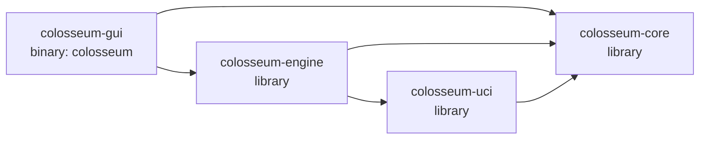
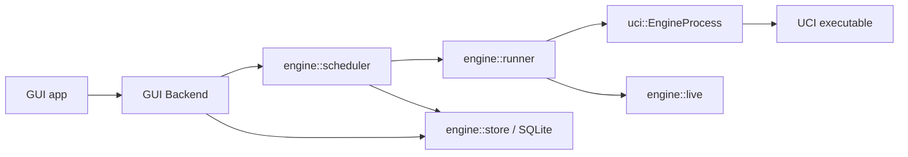

# Current dependency inventory

This document is the evidence artifact for GUIDE step 0.1. It records the
workspace, package and source-module graph as it exists before the CLI
architecture work. Ownership and Clean Architecture findings are intentionally
deferred to `current-state.md` in step 0.2.

## Inventory baseline

| Item | Value |
|---|---|
| Source baseline | `c62d99c1b56c04b57902b6e7b892028a22558cda` |
| Cargo / rustc used | 1.97.1 / 1.97.1 |
| Workspace resolver | Cargo resolver 2 |
| Workspace edition / MSRV | Rust 2024 / Rust 1.88 |
| Workspace version | 1.0.2, inherited by all four packages |
| Workspace members | `crates/*` |

The inventory was produced with:

```text
cargo metadata --format-version 1 --no-deps
cargo tree --workspace --depth 1 --edges normal,build
cargo tree --workspace --depth 1 --edges dev
cargo tree -p colosseum-gui --invert <workspace-package> --depth 2
rg --files crates
source inspection of Cargo.toml, crate roots, module imports and public exports
```

## Workspace package graph



There are no dependency edges from a headless package to
`colosseum-gui`. The GUI is the only binary target at this baseline.

| Package | Target | Internal dependencies | Source modules | Rust source lines |
|---|---|---|---:|---:|
| `colosseum-core` | library | none | 15 | 2,744 |
| `colosseum-uci` | library | `colosseum-core` | 6 | 1,020 |
| `colosseum-engine` | library | `colosseum-core`, `colosseum-uci` | 12 | 5,056 |
| `colosseum-gui` | `colosseum` binary plus build script | `colosseum-core`, `colosseum-engine` | 17 | 14,369 |

Counts include each crate root and describe the baseline only; they are not
architectural targets.

## Direct external dependencies

This table lists normal and build dependencies declared directly by each
package. Transitive packages remain captured by `Cargo.lock`.

| Package | Direct external dependencies |
|---|---|
| `colosseum-core` | `serde`, `thiserror`, `uuid` (`v4`, `serde`) |
| `colosseum-uci` | `thiserror`, `tokio` (`process`, I/O, runtime, sync, time), `tracing` |
| `colosseum-engine` | `anyhow`, `crossbeam-channel`, `directories`, `rusqlite` (bundled SQLite), `serde`, `serde_json`, `shakmaty`, `thiserror`, `time`, `tokio`, `toml`, `tracing`, `uuid` |
| `colosseum-gui` | `anyhow`, `crossbeam-channel`, `eframe`, `egui`, `egui_extras`, `image`, `raw-window-handle`, `rfd`, `serde`, `serde_json`, `shakmaty`, `tokio`, `tracing`, `tracing-subscriber`, `ureq`; Windows build dependency `winresource` |

`colosseum-engine`, `colosseum-gui` and `colosseum-uci` each declare
`tempfile` as a development dependency. `colosseum-core` has no development
dependency.

## Source-module inventory

### `colosseum-core`

Every source module is public from the crate root.

| Module | Lines | Current contents |
|---|---:|---|
| `adjudication` | 253 | Draw, resignation and maximum-move rules and decisions |
| `branding` | 22 | Product and application-directory naming constants |
| `engine` | 65 | Saved engine metadata and launch/configuration values |
| `event` | 38 | Backend-to-GUI tournament events |
| `export` | 174 | Standings and crosstable CSV construction |
| `game` | 67 | Results, terminations, game statistics and pairings |
| `ids` | 45 | Engine, game and tournament UUID wrappers |
| `options` | 196 | UCI option schemas, values and recognised option-name rules |
| `pairing` | 302 | Round-robin and gauntlet schedule generation |
| `rating` | 456 | Performance and joint maximum-likelihood ratings |
| `standings` | 463 | WDL, points, head-to-head and pair aggregation |
| `stats` | 246 | Trinomial Elo/error, LOS and SPRT |
| `time` | 151 | Clock, movetime, node and depth controls |
| `tournament` | 223 | Tournament, opening, common-option and rating-writeback configuration |
| `lib` | 43 | Public module declarations and convenience re-exports |

The crate-root public surface re-exports the configuration, identity, schedule,
result, rating, statistic, export and adjudication families.

### `colosseum-uci`

| Module | Lines | Current contents |
|---|---:|---|
| `error` | 22 | UCI-layer error type |
| `parse` | 330 | Pure `option`, `info` and `bestmove` line parsers |
| `position` | 148 | UCI `position` and `go` command models |
| `process` | 474 | Async process spawn, handshake, option, search and shutdown operations |
| `score` | 26 | Reported centipawn/mate score representation |
| `lib` | 20 | Public module declarations and convenience re-exports |

The crate root exposes `EngineProcess`, `SpawnOptions`, handshake/search
results, command models, parsers, scores and `UciError`. Both `parse` and
`process` import the UCI option schema from `colosseum-core`.

### `colosseum-engine`

| Module | Lines | Current contents |
|---|---:|---|
| `config` | 341 | Application configuration, application directories and engine-library JSON I/O |
| `detect` | 268 | One-shot UCI engine detection |
| `error` | 31 | Orchestration error type |
| `incidents` | 70 | Incident output-directory registration and forensic report writing |
| `live` | 192 | Shared live-game/search state |
| `openings` | 428 | EPD/PGN opening loading, selection inputs and summaries |
| `paths` | 48 | Platform application path derivation |
| `pgn` | 204 | PGN tag and movetext output |
| `runner` | 1,164 | One complete two-engine chess game |
| `scheduler` | 1,425 | Tournament lifecycle, concurrency, resume and result assembly |
| `store` | 852 | SQLite tournament/game persistence |
| `lib` | 33 | Public module declarations and convenience re-exports |

The crate root exposes app/config data, detection, live state, opening tools,
game-runner specifications/results, scheduler commands/snapshots/results and
SQLite row/store types. It also re-exports `colosseum_uci::Score`.

### `colosseum-gui`

All GUI modules are private to the `colosseum` binary.

| Module | Lines | Current contents |
|---|---:|---|
| `app` | 630 | Top-level application shell and window state |
| `backend` | 500 | GUI-to-async-tournament bridge |
| `board` | 120 | Chess-board rendering |
| `dialog` | 70 | Native file-dialog helpers |
| `eco` | 149 | Embedded ECO classification |
| `engines_tab` | 2,528 | Engine-library management UI |
| `export_ui` | 72 | File export UI |
| `icon` | 131 | Application icon construction |
| `live_view` | 1,501 | Live board, engine panels and evaluation graph |
| `logo` | 235 | Engine-logo storage and texture cache |
| `main` | 160 | Binary entry point and composition |
| `presets` | 367 | Tournament preset persistence |
| `results_tab` | 3,438 | Live and historical tournament results UI |
| `theme` | 518 | Visual theme |
| `tournament_tab` | 2,790 | Tournament configuration and launch UI |
| `update` | 137 | GitHub release update check |
| `widgets` | 1,023 | Shared GUI widgets |

## Observed module-level dependency paths

These are source-import paths, not target-architecture decisions.

| Consumer | Imported workspace surface |
|---|---|
| GUI `main` / `app` | Core branding; engine application directories and tournament status |
| GUI `backend` | Core tournament/engine types; engine scheduler, store and config APIs |
| GUI engine/tournament/results modules | Core configuration, statistics and IDs; engine detection, summaries, live state and results |
| Engine `config` | Core engine and tournament configuration types |
| Engine `paths` | Core branding constants |
| Engine `detect` | Core UCI option schema; UCI process API |
| Engine `runner` | Core game/time/adjudication types; UCI process/search API |
| Engine `scheduler` | Core schedule/rating/configuration types; UCI spawn options; engine runner/store/live modules |
| Engine `store` | Core IDs, configurations, results and standings inputs |
| UCI `parse` / `process` | Core UCI option schema |

The principal runtime call path visible in the source is:



## Test-target inventory

The baseline all-target workspace run contains 149 tests:

| Target | Tests | Coverage surface |
|---|---:|---|
| `colosseum-core` unit tests | 52 | Domain rules, scheduling, ratings, statistics and exports |
| `colosseum-engine` unit tests | 40 | Configuration, openings, PGN, runner clocks, scheduler options and store |
| Engine bulk-insert integration test | 1 | SQLite batch performance |
| Engine runner integration tests | 4 | Setup failure and complete game/opening flows |
| Engine scheduler integration tests | 7 | Scheduling, failure, stop and resume flows |
| `colosseum-gui` unit tests | 28 | Presentation models, presets, update parsing and visual helpers |
| `colosseum-uci` unit tests | 16 | Parsing and command construction |
| UCI Stockfish integration test | 1 | Full external-engine lifecycle when its configured executable is available |

The integration-test source files are:

```text
crates/colosseum-engine/tests/bulk_insert_timing.rs
crates/colosseum-engine/tests/runner.rs
crates/colosseum-engine/tests/scheduler.rs
crates/colosseum-engine/tests/common/mod.rs
crates/colosseum-uci/tests/stockfish.rs
```

## Build and release targets

- Root build scripts for Windows, Linux and macOS build only the `colosseum`
  GUI binary and copy/package it under `dist`.
- `.github/workflows/release.yml` is the only workflow. It is triggered by a
  published GitHub release and builds/packages the GUI binary for Windows x64
  and arm64, Linux x64, and macOS arm64.
- Linux package metadata and Windows/macOS GUI assets live under
  `colosseum-gui` and `packaging`.
- There is no CLI package, binary, artifact or release target at this baseline.

## Step 0.1 completion evidence

The package graph accounts for all four workspace members and every internal
edge reported by Cargo. The module tables account for every Rust source file
under each crate's `src` directory. Test targets and the current release
workflow are also identified. Step 0.2 can therefore evaluate ownership,
framework direction, global state and public boundary violations without
rediscovering the repository structure.
