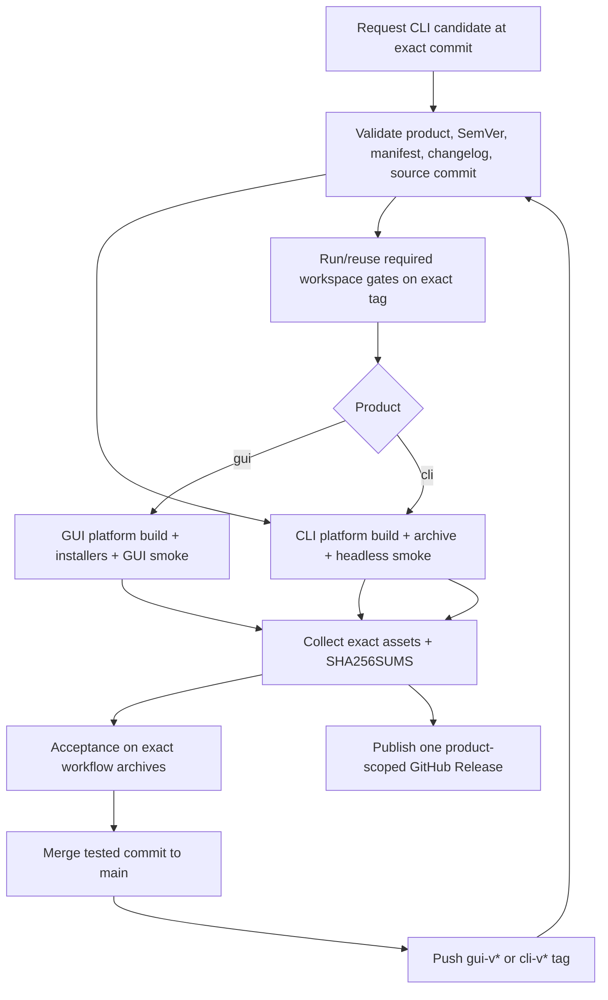

# Independent release and CI architecture

This document is the design artifact for GUIDE step 0.5. It applies the
independence contract in PLAN §S4 to the actual version, workflow, packaging and
documentation surfaces recorded by the Phase-0 inventory. ADR-0006 accepts one
repository with independently released GUI and CLI products.

This is a target design, not a claim about implemented automation. Phase 2 adds
the independently versioned CLI package and architecture checks; Phase 9 builds
and verifies the final publication workflows. Until those steps land,
[`docs/DEVELOPMENT.md`](../DEVELOPMENT.md) remains the authority for the current
GUI-only release process.

ADR-0008 binds **Colosseum** / `colosseum` / `colosseum-gui` for the desktop
lane and **Colosseum CLI** / `colosseum-cli` for the CLI lane throughout
implementation. Phase 9.0 may retain that identity or explicitly migrate the
whole product; release architecture never renames a surface implicitly.

## Current baseline and decision

The baseline has one workspace version, one GUI binary, one GUI changelog and
one release-triggered workflow. There is no push/pull-request CI workflow. The
current release builds GUI packages for Windows x64/ARM64, Linux x64, macOS
ARM64 and Arch x64, then attaches them to an already-published unscoped
`vX.Y.Z` GitHub Release. Its smoke test proves file existence/size, not product
behavior.

The target keeps one repository and creates two product lanes:

| Concern | GUI lane | CLI lane |
|---|---|---|
| Cargo product package | `colosseum-gui` | `colosseum-cli` |
| Version authority | explicit package `version` | explicit package `version` |
| Tag | `gui-v<semver>` | `cli-v<semver>` |
| GitHub Release title | `Colosseum <semver>` | `Colosseum CLI <semver>` |
| Release notes | GUI changelog section | CLI changelog section |
| Workflow | `.github/workflows/release-gui.yml` | `.github/workflows/release-cli.yml` |
| Artifacts | desktop archives/installers | headless binary archives |
| Product smoke | GUI package/version/startup checks | `--version`, `--help`, `self-test`, deterministic JSON workflow |

One required `.github/workflows/ci.yml` validates the shared workspace for
every push and pull request and exposes the same jobs through `workflow_call`.
Product release workflows call those checks for the exact tag but do not
trigger one another.

## Version ownership

### Product packages

The `colosseum-gui` and `colosseum-cli` packages own independent SemVer values
in their package manifests. The root workspace no longer supplies a product version.
The GUI retains `1.0.2` when the manifests are decoupled; the CLI selects its
initial version when its package is added.

`env!("CARGO_PKG_VERSION")` remains valid in each binary and reports that
binary package's version. CLI run records use the CLI package version plus a
build/source revision; `schema_version` and `stats_version` remain separate
compatibility identifiers and never substitute for product SemVer.

Shared crates (`core`, `application`, `uci`, `engine`) carry explicit internal
Cargo versions as required by Cargo, but those versions:

- are not copied into GUI or CLI release tags;
- are not a user-facing compatibility promise while the crates are unpublished;
- are identified in shipped binaries by the tagged source revision/lockfile;
- change only if an actual package-consumer policy later requires it.

Product packages and currently internal shared packages declare their intended
registry publishing policy explicitly rather than accidentally becoming
publishable. `colosseum-cli` starts with `publish = false`; Phase 9.0/9.4 may
change that only after an explicit registry-distribution decision and package
availability check. V1 binary distribution does not require registry
publication.

### Version validation

A small repository-owned, `publish = false` Rust package under `tools/release`
provides the cross-platform release-metadata command. It is tested with the
workspace and is the single parser for product, SemVer and changelog data.
Given a tag, it must:

1. accept only `gui-v<valid-semver>` or `cli-v<valid-semver>`;
2. map the prefix to exactly one product package/workflow;
3. require tag SemVer to equal that package's manifest version exactly,
   including prerelease/build semantics allowed by the release policy;
4. require a matching release-note heading in the correct product changelog;
5. reject a matching heading in only the other product's changelog;
6. emit filesystem-safe artifact/version values rather than letting each shell
   script parse the tag independently;
7. report whether the version is a prerelease.

Release SemVer is `major.minor.patch` with an optional prerelease suffix. Build
metadata (`+...`) is rejected for product tags and package versions because it
does not define precedence consistently across GitHub and native package
formats.

The command is used locally, in CI and in both release workflows. Packaging
tools that require numeric versions receive a validated platform projection
(for example MSI `major.minor.patch`), while archives and GitHub releases keep
the full SemVer. A projection never changes the product version reported by the
binary.

## Tags and GitHub Releases

Examples:

```text
gui-v1.0.3
gui-v1.1.0-rc.1
cli-v0.1.0
cli-v0.2.0-rc.1
```

Tags are immutable and identify the exact source/lockfile used for all assets.
The workflow is triggered by a tag push, validates the tag before building, and
creates the GitHub Release only after every required build, package, checksum
and smoke job succeeds. It may update a draft created by automation, but it must
not publish an incomplete release first.

The release workflow verifies that the tagged commit is reachable from the
protected primary branch unless an explicitly documented emergency release
procedure is invoked. Stable and prerelease status comes from the validated
SemVer, not a manually inconsistent checkbox.

Historic unscoped `v0.1.0`–`v1.0.2` releases remain immutable GUI history. They
are not duplicated or retagged. The next GUI version begins the new namespace.

GitHub provides only one repository-wide “latest” release, so this project does
not use it as a product update contract:

- the GUI updater lists releases and selects the highest compatible stable
  `gui-v` tag, with a legacy `v` fallback only for versions through 1.0.2;
- any future CLI updater selects only `cli-v` tags;
- README download links lead to explicit product releases/release lists rather
  than `/releases/latest`;
- prereleases are ignored by stable update checks unless the user opts into a
  prerelease channel.

## Release-note ownership

The current `CHANGELOG.md` is GUI history. Before the first independent
release, documentation migration creates:

- `CHANGELOG-GUI.md`, preserving all existing entries and legacy tag links;
- `CHANGELOG-CLI.md`, beginning with the CLI's first published version;
- a short root `CHANGELOG.md` index linking both streams, so existing project
  links remain useful.

Both product changelogs contain released user-visible changes only. Internal
phase numbers, architecture argumentation and unreleased implementation detail
stay in PLAN/GUIDE/ADRs. A shared-code change is mentioned in each product
changelog only when it changes that product's user-visible behavior.

The release-metadata command extracts the matching product/version section as
the GitHub Release body. The workflow does not synthesize cross-product notes or
overwrite a release with the other product's changelog. CLI changes to
`schema_version`/`stats_version` link to the versioned format-definition
changelog required by PLAN §5.8.

## Artifact contract

Artifact basenames contain product, full version, OS and architecture. They do
not use raw tag strings, so tag-prefix punctuation cannot create invalid paths.
Every release includes a `SHA256SUMS` file covering every uploaded asset.

Public binary/artifact basenames use the concrete Colosseum identity. The
internal product lanes and `gui-v`/`cli-v` tag namespaces remain stable as
decided in ADR-0006, including after an optional Phase 9.0 rebrand.

### GUI artifacts

The stable GUI lane preserves the existing supported package set:

| Platform | Target | Required assets |
|---|---|---|
| Windows x64 | `x86_64-pc-windows-msvc` | portable ZIP, MSI |
| Windows ARM64 | `aarch64-pc-windows-msvc` | portable ZIP, MSI |
| Linux x64 | `x86_64-unknown-linux-gnu` | tar.gz, DEB, RPM |
| Arch Linux x64 | native Arch container | `.pkg.tar.zst` |
| macOS ARM64 | `aarch64-apple-darwin` | tar.gz, DMG containing `.app` |

Names follow `colosseum-<version>-<os>-<arch>.<format>`. GUI archives and
installers contain only GUI runtime/assets, licence and applicable user
documentation. Existing desktop IDs, WiX upgrade identity and macOS bundle
identity remain GUI-owned and are never reused for CLI installation.

Prereleases must provide portable archives on every target. A native installer
is emitted for a prerelease only when its package format can represent the full
version and upgrade ordering without colliding with the later stable release;
Windows MSI is omitted by default for this reason. Stable releases must provide
the complete table above.

### CLI artifacts

The CLI lane ships native headless archives on every currently supported
release target:

| Platform | Target | Required asset |
|---|---|---|
| Windows x64 | `x86_64-pc-windows-msvc` | ZIP containing `colosseum-cli.exe` |
| Windows ARM64 | `aarch64-pc-windows-msvc` | ZIP containing `colosseum-cli.exe` |
| Linux x64 | `x86_64-unknown-linux-gnu` | tar.gz containing `colosseum-cli` |
| macOS ARM64 | `aarch64-apple-darwin` | tar.gz containing `colosseum-cli` |

Names follow `colosseum-cli-<version>-<os>-<arch>.<format>`. The archive contains
the binary, licence and version-matched CLI documentation needed for offline
use. It contains no GUI executable, icons, desktop entry, installer metadata,
engine, book, language runtime or writable installation data. Linux package
manager formats may be added by a later release decision; they are not required
for the first CLI release and cannot delay portable archives.

Artifact jobs fail on a missing or unexpected file. A checksum manifest is
generated only after the final filenames are known and is itself retained with
the release workflow logs. Signing/notarization or artifact attestations may be
added without merging the product lanes; lack of those optional facilities must
be documented accurately rather than silently claimed.

## Required push and pull-request CI

The required workflow runs without external engine installations or paths
outside the checkout. It has no path filter that can skip one product when a
shared package changes.

### Quality and architecture job

On Linux:

```text
cargo fmt --all --check
cargo check --workspace --tests
cargo clippy --workspace --all-targets -- -D warnings
architecture/dependency/version/release-metadata checks
```

Architecture checks assert the accepted Cargo edges, no GUI/windowing dependency
in CLI, no GUI app-data access from CLI tests, independently owned product
versions and complete tag/workflow mappings. Workflow lint/schema validation
runs before release YAML changes merge.

### Cross-platform test matrix

Run the full hermetic workspace suite on:

| OS runner | Debug | Release |
|---|---:|---:|
| Windows | required | required |
| Linux | required | required |
| macOS | required | required |

Each cell executes `cargo test --workspace --all-targets` with the corresponding
profile. Release-mode compilation is not inferred from a debug pass. Linux jobs
install the GUI build dependencies required by the workspace. Required tests
never locate a developer engine or silently return success when it is absent;
the repository-owned UCI stub supplies lifecycle coverage when Phase 2.7 lands.

Optional real-engine, calibration and external-runner parity jobs are explicitly
labelled non-required/manual evidence. Their absence cannot turn a platform or
release green.

### Change routing

| Changed area | Required regression surface |
|---|---|
| `core`, `application`, `uci`, `engine`, root manifest/lockfile | complete GUI + CLI workspace suite and architecture checks |
| GUI source/assets/packaging | complete required suite plus GUI-specific tests/package validation |
| CLI source/config/docs/packaging | complete required suite plus CLI integration/published-style smoke |
| workflow/build/release tooling | workflow validation plus affected product dry-run/package checks |
| statistics/schema semantics | complete suite, fixture/oracle checks and required version/changelog assertions |

The default implementation simply runs the complete required suite for every
push/PR. Future selective CI is permitted only if a tested dependency-aware
router proves that shared changes cannot skip either product.

## Release workflow design

CLI acceptance is branch-first. A `cli` push whose commit subject contains
`[cli candidate]` (or a manual dispatch after the workflow reaches `main`)
creates four immutable, unpublished workflow archives plus
`SHA256SUMS` and `CANDIDATE.json`; it does not create a tag or GitHub Release.
The run ID, full commit SHA and checksums identify the exact candidate used by
acceptance. The public stable lane becomes available only after that commit is
reachable from `main`. This avoids a public prerelease while retaining exact
cross-platform artifact evidence.



Use two small entry workflows rather than one 500-line conditional workflow:

- `release-gui.yml` owns GUI system dependencies, WiX, DEB/RPM/Arch, app bundle
  and DMG behavior migrated from the current `release.yml`;
- `release-cli.yml` owns only headless builds/archives and therefore installs no
  GUI or installer toolchain; an explicit candidate marker/manual dispatch
  produces only an unpublished commit-addressed candidate, while `cli-v*`
  produces a public release;
- repository-owned release metadata/packaging helpers provide common version,
  filename, checksum and note extraction;
- build jobs use read-only permissions; only the final publish job receives
  `contents: write`;
- release jobs use explicit product package/binary selections, never ambiguous
  `cargo build --bin` resolution or root-version parsing.

Cargo commands use the committed lockfile with `--locked`. Third-party actions,
container images and packaging tools are pinned to reviewed immutable versions
(action commit SHA with a version comment where practical), with automated
update review rather than floating “latest” installation during a release.

The release job checks out the immutable tag and must not modify source files or
generated lock state. All artifacts for one release come from that same tag and
validated product version.

Before the final candidate, merge current `main` into `cli` and resolve/test
there. Do not squash the accepted candidate away: its source commit must remain
an ancestor of `main`. Any post-candidate change to Rust source, Cargo inputs,
`README.md`, `docs/cli/`, release helpers or workflows invalidates acceptance.
PLAN/GUIDE evidence-only changes are permitted when they cannot alter archive
contents. The stable tag workflow verifies ancestry, rebuilds from the tagged
commit, re-runs the exact-archive smoke matrix and publishes only after every
platform succeeds.

### Published-artifact smoke tests

Tests run against the unpacked final archive/package, not `target/release`:

| Product | Required smoke evidence |
|---|---|
| GUI | expected executable/package files, platform package metadata, and an added noninteractive `--version` path that reports the tag version and exits before GUI initialization |
| CLI | `--version`, `--help`, headless `self-test`, and one deterministic JSON-mode workflow using the internal stub |

CLI smoke asserts stdout is valid JSON where promised, diagnostics stay on
stderr, no GUI/window server/library is required, and all created state remains
inside an isolated temporary run directory. The reported version must equal the
tag/package version. Checksums are recomputed after download in the publish job
before attachment.

## Current-to-target release migration

| Current surface | Target action | Delivery step |
|---|---|---|
| Root `[workspace.package].version = 1.0.2` inherited by all crates | Give GUI/CLI explicit product versions; give internal crates explicit non-product versions; remove root product authority | 2.2 |
| Current `colosseum-gui` package/binary `colosseum` | Preserve the identity and give it GUI-specific version lookup | 2.2/9.4 |
| No CLI package/binary | Add independently versioned `colosseum-cli` package/composition root and binary | 2.2 |
| `.github/workflows/release.yml` on published unscoped release | Replace with required `ci.yml`, `release-gui.yml` and `release-cli.yml`; tag push validates before publication | 2.2 baseline, 9.4 publication |
| Global `contents: write` | Limit write permission to final publish jobs | 9.4 |
| Raw `github.ref_name` parsed repeatedly in shell | Use one tested internal Rust release-metadata command | 2.2/9.4 |
| File-size-only GUI smoke | Test final package metadata/version/startup as supported | 9.4 |
| No published CLI smoke | Test exact archive with help/version/self-test/JSON workflow | 2.7 then 9.4 |
| `build_windows.ps1`, `build_linux.sh`, `build_macos.sh` build only `--bin colosseum` | Keep explicit GUI scripts and add separate CLI scripts/targets; obtain versions through metadata, never `grep` root manifest | 2.2/9.4 |
| GUI Cargo DEB/RPM metadata, `wix/main.wxs`, `build.rs`, `packaging/` desktop/icon and DMG assets | Remain GUI-owned and consume GUI package version; CLI packaging imports none of them | 9.4 |
| Arch PKGBUILD generated inside workflow | Remain GUI-owned; use validated GUI version/filename helper | 9.4 |
| `CHANGELOG.md` contains GUI history | Preserve it as `CHANGELOG-GUI.md`, add CLI stream and root index | 2.2 lane foundation; 9.4 release content |
| README and GUI updater use repository-wide latest release | Use product-specific links/tag filtering with legacy GUI fallback | 9.4 |
| `docs/DEVELOPMENT.md` describes GUI-only release | Update only when the new scripts/workflows actually exist | 2.2/9.4 |
| No push/PR CI; required engine tests may skip | Add matrix CI; Phase 1.8/2.7 make lifecycle tests hermetic and non-skipping | 1.8/2.7/9.4 |

No current GUI artifact, package identity or historic release is deleted by the
migration. The old workflow is removed only after the GUI lane can reproduce
its complete artifact matrix from a `gui-v` tag.

## Release responsibility boundary

Repository release automation verifies its own source, binary, dependencies,
artifacts and test evidence. It does not build user chess engines, compare their
compilers/flags, inspect source trees, run custom engine fingerprints or certify
that two user executables are comparable. Those remain engine-project policy.

The CLI archive ships no engine or book. Release smoke uses only the internal
deterministic UCI stub compiled into the exact CLI artifact.

## Step 0.5 completion evidence

This design assigns every current version/build/release/documentation surface,
defines independent product versions/tags/notes/artifacts, specifies required
shared-layer debug/release CI on all supported operating systems, and makes the
published CLI artifact's headless behavior testable. ADR-0006 records why the
repository remains unified. Phase 0.7 reviews the combined contract; ADR-0008
supplies the concrete Colosseum mapping without reopening the product-lane or
release-independence decisions. Phase 9.0 may reassess the identity once, but
cannot merge those lanes.
