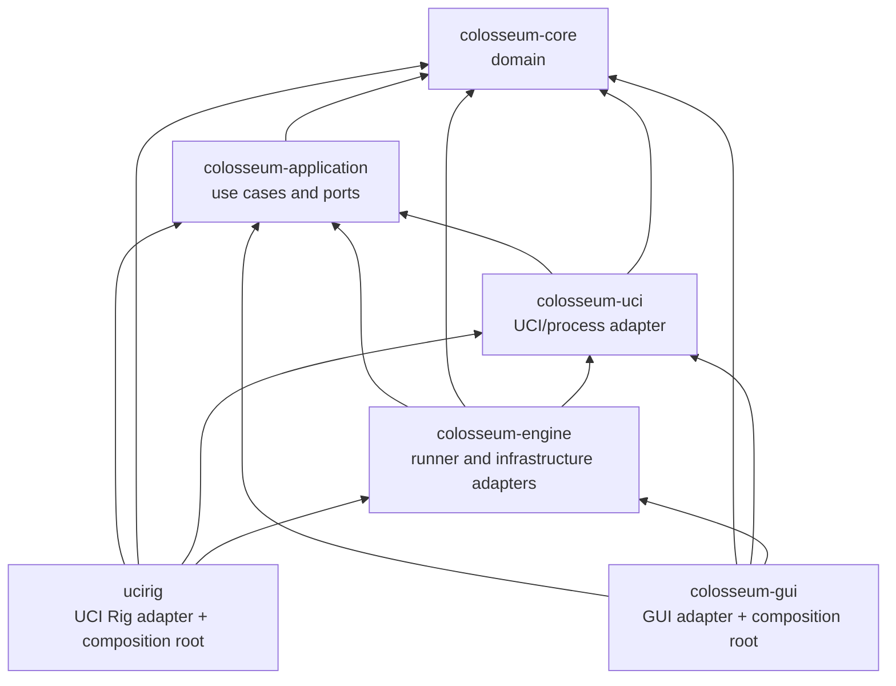
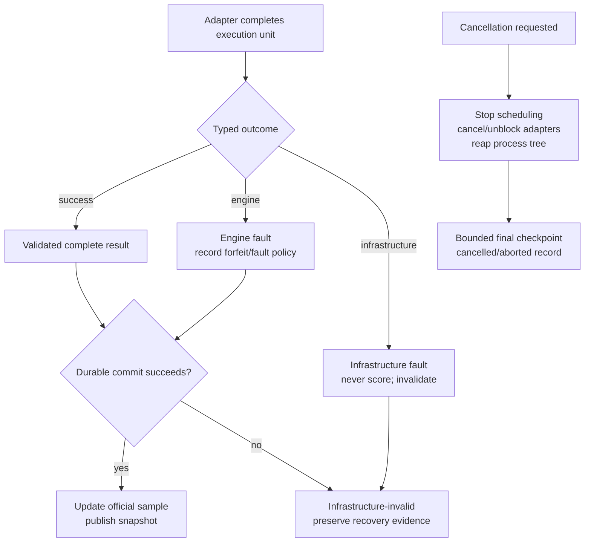

# Target architecture

This document is the design artifact for GUIDE step 0.3. It converts the
findings in [`current-state.md`](current-state.md) into the target ownership and
migration plan required by PLAN §S4. The factual baseline remains
[`dependency-inventory.md`](dependency-inventory.md).

The design is intentionally incremental. Colosseum gains an application
boundary and independent CLI composition root without replacing the working UCI
parser, process lifecycle, chess-game runner, opening parser, SQLite history or
GUI. The consequential choices below are accepted in the
[`adr/`](adr/README.md) decision records. The independent product/version/CI
model is specified in
[`release-architecture.md`](release-architecture.md).

## Architectural decision

Add one inner library, `colosseum-application`, between the domain and driven
adapters. Keep the other package names and give them narrower ownership:

| Package | Target layer and responsibility |
|---|---|
| `colosseum-core` | Domain entities and deterministic rules: results, schedules, ratings, statistics, adjudication, search controls and opaque identity values |
| `colosseum-application` | UI-independent use cases, input/output models, run invariants and ports; no process, filesystem, database, OS, GUI or async-runtime implementation |
| `colosseum-uci` | UCI protocol and process adapter implementing application engine-session ports |
| `colosseum-engine` | Headless infrastructure adapters: game execution, opening/position input, PGN and forensic artifacts, SQLite/run-directory repositories, topology and affinity |
| `ucirig` | UCI Rig CLI driving adapter and composition root; added in Phase 2 |
| `colosseum-gui` | GUI driving adapter, GUI-only library/configuration/read models and independent composition root |

This is the smallest package change that creates a stable inward-facing seam.
Splitting every adapter into its own crate would add coordination without
strengthening the dependency rule. Keeping use cases in `colosseum-engine`
would leave the CLI coupled to SQLite, Tokio and GUI-shaped public types.

## Dependency rule

Arrows below mean “may depend on.” No arrow may be reversed.



The logical layers are stricter than package visibility alone:

- Domain code may use pure Rust libraries but no I/O, OS discovery, wall or
  monotonic clock acquisition, entropy, framework type or product policy.
- Application code may depend on domain values and abstract ports. It may be
  asynchronous at its API boundary, but cannot expose Tokio, crossbeam,
  rusqlite, egui or OS-specific types.
- Adapters translate application models to UCI, SQLite, files, platform APIs
  and presentation models. Concrete adapter errors do not cross inward.
- Drivers own runtimes, processes, threads, channels and shutdown mechanics.
- Only `ucirig` and `colosseum-gui` assemble concrete implementations.
  Neither composition root calls or reads the other.

`colosseum-engine` may depend on `colosseum-uci` because its retained game
executor drives UCI sessions. `colosseum-application` must never depend on
either adapter. The CLI dependency tree must contain no GUI/windowing package,
and the application/core trees must contain no Tokio, SQLite or OS-topology
implementation.

## Domain ownership

The domain owns values and rules that remain true regardless of how a run is
started or stored:

- opaque `ParticipantId`, `GameId`, `PairId` and `RunId` values, with parsing and
  construction from supplied bytes/UUIDs but no random constructors;
- game results, termination reasons and committed pair/mini-match outcomes;
- tournament formats and deterministic schedule-generation rules;
- adjudication decisions and search/time-control values;
- standings, rating models, pentanomial/trinomial samples, SPRT and SPSA math;
- run-state transition invariants and typed validation errors where they are
  independent of a command or storage format.

The domain does not know executable paths, books, PGN, UCI processes, saved GUI
engines, SQLite rows, run directories, progress channels or display labels.
Pure UCI option schemas are application boundary values rather than chess
domain entities: application use cases must validate options, while the UCI and
GUI adapters both consume the same model.

## Application use cases

Every driving adapter calls the same use case; the CLI and GUI do not maintain
parallel implementations.

| Use-case family | Responsibilities owned by the application layer |
|---|---|
| Engine inspection/check | Orchestrate handshake, option validation, bounded search and shutdown; return an engine-independent inspection report |
| Fixed match and SPRT | Resolve the deterministic unit schedule, request games, classify faults, commit in the required order and derive official statistics |
| Calibration | Reuse the match use case and classify PASS/FAIL/INCONCLUSIVE/INVALID; never act as a prerequisite |
| SPSA | Validate knobs, derive seeded perturbations, schedule atomic mini-matches, commit updates and emit closed-loop artifacts |
| NPS and position suites | Define workload/state policy, ordering, authoritative timing and aggregate results |
| Tournament | Generate round-robin/gauntlet schedules, coordinate execution and expose generic standings/snapshots |
| Book and statistics tools | Validate/transform input through ports and reuse the same domain calculations used by live runs |
| Durable run/status | Create or resume against resolved configuration, maintain committed state, and return a read-only atomic snapshot |

The application chooses *what* unit may run, what is official, when a unit is
committed and what a failure means. Adapters choose *how* an executable is
spawned, a file is read, a transaction is written or progress is displayed.

### Runtime boundary types

The application package owns small UI-independent input and output models.
Names may be refined in step 0.4, but their contents and separation are
binding.

| Type | Required contents and exclusions |
|---|---|
| `EngineLaunchSpec` | Canonical executable path, argument vector, optional working directory, environment overrides, optional label, effective UCI option values and allocated logical CPUs. No logo, saved rating, author, notes, detected schema, GUI ID, build command or arbitrary metadata |
| `RuntimeParticipant` | Run-local `ParticipantId` plus one `EngineLaunchSpec`; same executable with different options is valid |
| `EngineInspection` | UCI identity, advertised option schema, protocol/check observations and bounded diagnostics returned by the engine-session port |
| `ResolvedRunConfig` | Fully resolved command policy, participants, hashes, seed contract, schedule/model versions and optional input-source identity; contains no GUI library reference |
| `ExecutionUnit` | Stable scheduled identity and immutable inputs for a game, colour pair, SPSA mini-match or suite position |
| `GameExecutionReport` | Moves, raw result/termination, charged timing observations, bounded engine diagnostics and an explicit success/fault classification; no SQLite row or GUI live handle |
| `CommittedRunSnapshot` | Last durable sequence, counts, official sample/statistics, anomalies, terminal state and ETA inputs; presentation-neutral |
| `ProgressEvent` | Advisory, bounded event derived only after the corresponding state transition or durable commit; no egui/crossbeam type |

Executable hashes and discovered identities belong to the resolved run record,
not to `EngineLaunchSpec`: launch configuration remains ordinary UCI process
input. Books and suites are optional run inputs, not engine descriptors.

## Port contracts

Ports are declared by `colosseum-application`.
[ADR-0003](adr/0003-application-ports-and-commit-boundary.md) fixes their Rust
async/object-safety and injection mechanism; their semantic contracts are
summarized here.

| Port | Contract | Initial adapter |
|---|---|---|
| `EngineSessionFactory` | Open an isolated session from `EngineLaunchSpec`; handshake, readiness, option application, search, stop and bounded shutdown are observable and cancellable. It returns typed observations/failures and owns no scoring policy | `colosseum-uci::EngineProcess` wrapper |
| `GameExecutor` | Execute one immutable game unit using fresh per-game sessions, legality/adjudication and the versioned clock policy; return one complete report or typed failure, never persist/count it | Refactored wrapper around `engine::runner::run_game` |
| `ExecutionPool` | Run a bounded number of immutable units through `GameExecutor`, return every completion with its stable unit identity, catch task loss/panic as infrastructure failure and honour cancellation. Completion order is observable but cannot choose commit order | Tokio task driver split from `engine::scheduler` |
| `RunRepository` | Create/resume, verify config identity, transact schedules and commit units, store checksummed checkpoints, recover the previous generation and read an atomic snapshot. No SQLite row types escape | SQLite adapter for the GUI; self-contained run-directory adapter for CLI |
| `ArtifactSink` | Append/write named logical artifacts such as log, PGN, run record, resolved config and incident report under a root selected by composition. Atomic/append requirements and criticality are explicit per operation | Filesystem/run-directory adapter; GUI-selected export adapter |
| `OpeningSource` | Resolve and validate an optional book/position source into deterministic, hashable opening inputs without exposing file I/O to a use case | Existing `engine::openings` split into parser/source adapter |
| `CpuPlacement` | Report capabilities, plan allowed CPUs and apply/verify placement or an explicit advisory/off fallback; application sees portable CPU identifiers and evidence | Per-OS topology/affinity adapters added in Phase 3 |
| `Clock` | Supply monotonic timestamps/resolution for decisions and UTC timestamps only for metadata. Elapsed measurement never uses the wall clock | Production system clock and deterministic fake clock |
| `IdGenerator` | Supply typed run/participant/game/unit identities. Replays and tests can inject exact sequences | OS-random adapter and deterministic test adapter |
| `MasterSeedSource` | Supply one master seed only when the resolved input omits it; named sub-stream derivation remains deterministic application/domain logic | OS-random adapter and fixed test adapter |
| `ProgressSink` | Accept presentation-neutral snapshots/events with bounded memory/backpressure semantics; failure to display advisory progress cannot alter official state | CLI renderer, JSON renderer and GUI read-model mapper |
| `Cancellation` | Expose cooperative stop state without a runtime token type; adapters must unblock pending work, perform bounded cleanup and report completion | CLI signal and GUI command adapters |

`GameExecutor` is the deliberate preservation seam for the existing 1,164-line
runner. The application owns scheduling, commit and fault/scoring policy; the
adapter retains UCI mechanics, chess legality, SAN, adjudication execution and
per-game process isolation. Versioned clock/fault inputs and a typed report make
those mechanics testable without letting the runner count, persist or publish a
result.

Application tests use in-memory/fake implementations of every required port.
They must be able to prove completion-versus-commit ordering, recovery, timing
boundaries and failure classification without starting Tokio, SQLite or a real
executable.

## Composition roots and owned resources

### CLI root

`ucirig::main` parses CLI/run files, selects or creates the run directory
and constructs the runtime. It then assembles UCI sessions, the game executor,
bounded execution pool, run repository, artifact sink, opening source, CPU
placement, clocks, identity, seed, progress and cancellation adapters. The root
passes only resolved application models to use cases.

It never reads `EngineLibrary`, `AppConfig`, `AppDirs`, GUI presets, GUI SQLite
history or a GUI application-data location. A generated CLI run is
self-contained beneath its chosen run directory and remains readable by the
published CLI without the GUI installed.

### GUI root

`colosseum-gui::main` and `Backend` remain the GUI composition root. GUI-owned
configuration loads saved engine/library data, maps selected entries to
`EngineLaunchSpec` and builds the same application use cases with the GUI
SQLite and progress adapters. Rating writeback is performed by the GUI after a
successful application result; it is not tournament/domain policy.

The GUI may retain its existing shared history database and stored JSON/TOML
formats. Adapter mappers preserve those formats while the inner model changes.
The GUI does not import or call `ucirig`.

### Test roots

Application tests compose deterministic in-memory ports. Adapter contract tests
compose one adapter with fakes. Published-artifact tests invoke the CLI's hidden
UCI stub through the real process and filesystem adapters. Optional local
real-engine tests are separate smoke roots and never required evidence.

## Run-directory and commit ownership

The root chooses a physical location; the application owns logical run state;
`RunRepository` and `ArtifactSink` own all concrete I/O below that location.
No inner type computes an application directory or calls `current_exe`, and no
process-global artifact directory exists.

The authoritative transition is:

```text
completed execution report
    -> application validates classification and scheduled identity
    -> RunRepository atomically commits the complete unit/checkpoint
    -> application updates official in-memory statistics
    -> ProgressSink publishes the committed snapshot
    -> secondary artifacts are appended under their declared durability rule
```

A game, pair or SPSA mini-match is never official before its required commit.
Repository failure leaves the unit uncommitted and makes the run
infrastructure-invalid; it cannot be represented as an engine result. A
required run-record/checkpoint/log/PGN write failure is surfaced and stops the
run. Failure to write a best-effort forensic supplement is attached as an
anomaly to the primary failure; it is never silently discarded or substituted
for that failure.

For CLI runs, the run-directory adapter enforces unique creation, explicit
resume, archive-on-restart, append-only logs, checksummed two-generation
checkpoints and stored-config authority. For the existing GUI, a SQLite adapter
can implement the same logical repository contract while preserving its
database and history behavior. A repository capability reports which durable
features it supports; a statistical CLI use case requires the full contract.

## Error and cancellation flow

Errors cross the application boundary as typed causes, never `anyhow`, raw
`std::io::Error`, `rusqlite::Error` or `UciError`.

| Classification | Examples | Application consequence |
|---|---|---|
| `ConfigurationFault` | Missing executable, invalid option/schema, incompatible resume, bad book | Refuse before scoring or scheduling work |
| `EngineFault { participant, kind }` | Engine exits, exceeds its allowed time, emits an illegal move or violates UCI during owned execution | Produce the explicitly configured forfeit/fault record; invalidate at the command's threshold; never relabel as infrastructure |
| `InfrastructureFault` | Spawn/pipe/clock/affinity failure attributable to the harness or OS, repository/artifact failure, task panic, lost completion | Never score; stop or invalidate the run and preserve recoverable evidence |
| `Cancelled` | User or owner requests supported stop | Stop scheduling, clean up boundedly, checkpoint and record aborted/cancelled state |
| `DomainError` | Invalid statistical/schedule state or non-finite result | Reject the transition; no artifact may claim an official result |

Adapter errors carry operation, participant/unit context and a source for logs,
then map once at the adapter boundary. Engine attribution is based on a written
classification table and fault-injection tests, not whichever concrete error
variant happened to arrive. A panic at a game/task boundary is caught as an
`InfrastructureFault`; a missing task result can never satisfy a finished-run
invariant.



Normal cancellation first stops new scheduling. The current atomic unit follows
the command's contract: finish a required half-pair where safe, otherwise mark
it incomplete and exclude it. The session/process adapter must unblock reads,
send `stop`/`quit` when applicable, escalate after a bounded deadline and reap
the owned process tree. Force-stop shortens graceful deadlines but does not
turn missing results into success. Progress channels are bounded and advisory;
durable state never depends on a consumer keeping up.

## Current-module migration map

Every source module in the Phase-0.1 inventory has a target owner below.
“Split” means move existing code at a seam while retaining behavior and
fixtures; it does not authorize a rewrite.

### `colosseum-core`

| Current module | Target owner | Migration |
|---|---|---|
| `adjudication` | `colosseum-core` domain | Keep pure rules and tests |
| `branding` | `colosseum-gui` presentation/platform policy; CLI owns its own identity after naming decision | Remove product/path constants from core |
| `engine` | GUI library model plus `colosseum-application::EngineLaunchSpec` | Split `EngineMeta`/saved data from minimal runtime launch data; inject identity |
| `event` | `colosseum-application::ProgressEvent` plus GUI mapper | Replace GUI-named inner event with presentation-neutral progress |
| `export` | `colosseum-engine` output adapter | Move CSV formatting out of domain; continue consuming domain standings |
| `game` | `colosseum-core` domain | Keep results/terminations; extend typed committed-unit values as needed |
| `ids` | `colosseum-core` values plus application `IdGenerator` port | Keep wrappers/parsing; remove UUID-v4 constructors and `v4` feature from core |
| `options` | `colosseum-application` engine boundary model | Move schema/value/recognised-name policy so UCI and driving adapters share an inward contract |
| `pairing` | `colosseum-core` domain | Keep deterministic scheduling; accept generic participant IDs/policy values |
| `rating` | `colosseum-core` domain | Keep and extend pure rating math |
| `standings` | `colosseum-core` domain | Keep aggregation keyed by runtime participants |
| `stats` | `colosseum-core` domain | Keep and extend statistical models in Phase 1 |
| `time` | `colosseum-core` domain | Keep search/time-control values; clock acquisition stays behind application port |
| `tournament` | Core tournament policy, application run request and GUI writeback adapter | Split paths/output/library writeback from format and rule values |
| `lib` | `colosseum-core` domain facade | Re-export only domain-owned surfaces; provide temporary deprecated shims only while GUI migration requires them |

### `colosseum-uci`

| Current module | Target owner | Migration |
|---|---|---|
| `parse` | `colosseum-uci` protocol adapter | Preserve parsers; map option models to the application boundary |
| `position` | `colosseum-uci` protocol adapter | Preserve command builders as adapter details |
| `score` | `colosseum-uci` protocol DTO | Preserve parsing DTO; map to application/domain evaluation observations before crossing inward |
| `process` | `colosseum-uci` process driver | Wrap `EngineProcess` behind `EngineSessionFactory`; make `SpawnOptions` an internal mapping from `EngineLaunchSpec`; later add bounded stdout and process-tree containment |
| `error` | `colosseum-uci` adapter error | Retain diagnostic detail locally and map to typed application fault context once |
| `lib` | `colosseum-uci` adapter facade | Export adapter constructors/contract helpers; stop exporting concrete process types as application inputs |

### `colosseum-engine`

| Current module | Target owner | Migration |
|---|---|---|
| `config` | `colosseum-gui` configuration/library adapter | Move `AppConfig`, `AppDirs` and `EngineLibrary` with serde compatibility; CLI never imports them |
| `detect` | Application inspect/check use case plus UCI adapter | Move orchestration inward; preserve name/version parsing as a pure helper at the appropriate boundary |
| `error` | Per-adapter errors in `colosseum-engine`; typed application failures at ports | Remove the omnibus workflow/infrastructure error from use-case APIs |
| `incidents` | `colosseum-engine` filesystem `ArtifactSink` | Replace `OnceLock` and sequence global with a run-scoped injected sink |
| `live` | Application snapshot/progress models plus `colosseum-gui` read model | Remove `Arc<Mutex>` from use-case API; GUI owns rendering-specific state |
| `openings` | `colosseum-engine` `OpeningSource` input adapter | Separate file access/format parsing from deterministic resolved opening values; retain validation and ordering fixtures |
| `paths` | `colosseum-gui` platform driver, merged with GUI `AppDirs` | Eliminate duplicate shared application-directory policy; CLI paths are selected by its root |
| `pgn` | `colosseum-engine` output adapter | Preserve pure formatter and expose it through logical artifact output |
| `runner` | `colosseum-engine` `GameExecutor` adapter | Preserve UCI/game mechanics and fresh processes; inject sessions, clock, artifacts and cancellation; remove persistence, scoring and GUI live-state ownership |
| `scheduler` | Application match/tournament orchestration plus engine `ExecutionPool` driver and GUI mapper | Move schedule/commit/fault policy inward; keep Tokio task mechanics outward; replace concrete Store/channels/snapshots with ports/models |
| `store` | `colosseum-engine` persistence adapters | Implement `RunRepository`; keep SQLite schema/row structs private to adapters and preserve GUI migrations/history |
| `lib` | `colosseum-engine` adapter facade | Export adapter constructors and contract-test helpers, not GUI config, SQLite rows or framework-shaped workflow state |

### `colosseum-gui`

| Current module | Target owner | Migration |
|---|---|---|
| `app` | `colosseum-gui` driving adapter | Keep shell/window state; consume GUI read models mapped from application snapshots |
| `backend` | `colosseum-gui` composition root and adapter | Retain runtime/resource assembly; move workflow policy to application use cases and perform library mapping/writeback here |
| `board` | `colosseum-gui` presentation | Keep |
| `dialog` | `colosseum-gui` platform/presentation adapter | Keep GUI-only global; it never crosses inward |
| `eco` | `colosseum-gui` presentation helper | Keep unless a future non-GUI use case justifies a shared pure component |
| `engines_tab` | `colosseum-gui` presentation/library adapter | Use GUI saved-engine model and map selected entries at the backend boundary |
| `export_ui` | `colosseum-gui` driving adapter | Keep dialogs; call headless export/artifact adapter with application results |
| `icon` | `colosseum-gui` presentation | Keep |
| `live_view` | `colosseum-gui` presentation/read model | Map generic progress snapshots to view state |
| `logo` | `colosseum-gui` presentation/filesystem adapter | Keep logos keyed by GUI library identity, never runtime launch data |
| `main` | `colosseum-gui` composition root/driver | Keep platform startup; stop installing shared incident global |
| `presets` | `colosseum-gui` configuration adapter | Keep stored compatibility and map presets to application requests |
| `results_tab` | `colosseum-gui` presentation/query adapter | Consume application results or GUI repository query models, not SQLite rows |
| `theme` | `colosseum-gui` presentation | Keep GUI-only global state |
| `tournament_tab` | `colosseum-gui` driving adapter | Build GUI form/preset data, then map to an application tournament request |
| `update` | `colosseum-gui` network adapter | Keep; CLI release/update behavior is independent |
| `widgets` | `colosseum-gui` presentation | Keep; change engine helpers to the GUI saved-engine model |

## Public-boundary migration

| Current public surface | Target boundary |
|---|---|
| `EngineConfig` / `EngineMeta` | GUI-owned saved `LibraryEngine` model; explicit mapper produces application `EngineLaunchSpec` and run-local identity |
| `TournamentConfig` | Pure core tournament policy + application `TournamentRequest` + adapter-owned opening/output locations |
| `RatingWriteback` | GUI adapter action after successful result; absent from domain/application run policy |
| `TournamentEvent` | Presentation-neutral application `ProgressEvent`; GUI maps it to repaint/library actions |
| `EngineId` / `GameId` / `TournamentId` | Core opaque values evolve to generic participant/game/run identities; creation moves to `IdGenerator`; legacy GUI/database IDs map losslessly |
| `UciOption` / `UciOptionValue` | Application engine schema/value boundary shared by UCI, CLI and GUI adapters |
| `OpeningBook` / `StartPosition` | Adapter-owned path/input specification maps through `OpeningSource` to path-free resolved start positions |
| `SpawnOptions` / `EngineProcess` | UCI-adapter implementation details behind `EngineSessionFactory`; not accepted by use cases |
| `DetectResult` / `HandshakeInfo` | Application `EngineInspection` with adapter diagnostics; no concrete process handle |
| `GameSpec` / `EngineGameSpec` | Application `ExecutionUnit` + `RuntimeParticipant`; runner-specific fields remain private to `GameExecutor` |
| `GameReport` / `ResolvedOpening` / `Score` | Application execution/opening/evaluation observations, with UCI and shakmaty DTOs mapped at adapter boundaries |
| `Tournament`, `Command`, `TournamentSnapshot`, `LiveGameHandle` | Application run control/cancellation and committed snapshot; GUI owns channel/mutex/read-model implementation |
| `TournamentResults`, `ResultParticipant`, `EloEntry`, `InFlightGame` | Presentation-neutral application query/snapshot DTOs derived from committed domain state |
| `Store` and public row structs | Private SQLite/run-directory adapters implementing `RunRepository`; GUI history queries return GUI/application DTOs |
| `AppDirs`, `AppConfig`, `EngineLibrary` | GUI-owned configuration adapter; no CLI or inner-layer dependency |

Temporary compatibility constructors/re-exports are allowed only to keep the
GUI compiling during a migration slice. They must be deprecated, point toward
the new mapper and be removed before Phase 2 exits; no new CLI code may use
them.

## Finding disposition

| Finding | Target resolution | Delivery gate |
|---|---|---|
| CS-01 | New application layer, driving use cases and driven ports; scheduler policy moves inward | 2.1 architecture tests and fake-port use-case tests |
| CS-02 | GUI library model maps once to minimal `EngineLaunchSpec`/`RuntimeParticipant` | 2.1 path-only and GUI compatibility tests |
| CS-03 | Branding, events, writeback, app dirs/config/library and live read models move to outer adapters | 2.1 dependency/public-surface checks |
| CS-04 | Opaque IDs remain domain values; `IdGenerator`, `MasterSeedSource` and `Clock` are injected | 2.1/2.4a deterministic tests |
| CS-05 | `RunRepository`, `ArtifactSink` and `OpeningSource` replace concrete/global I/O | 2.1 boundary plus 2.8 durable-run tests |
| CS-06 | Persistence-before-publication; every lost task/write is typed infrastructure failure | 2.7 fault injection and 2.8 recovery tests |
| CS-07 | Port-level engine/infrastructure fault taxonomy; application alone applies scoring/invalidation policy | 2.7 adapter fixtures and 4A.4 runner tests |
| CS-08 | Session/process port requires bounded traffic, cancellation and process-tree ownership | 2.7 flood/ignored-quit/descendant tests |
| CS-09 | Injected monotonic clock and versioned execution report; application defines equality/margin policy | 4A.2a clock fixtures |
| CS-10 | Common repository contract plus CLI run-directory adapter/status snapshot | 2.8/2.9 shared durable suite |
| CS-11 | Hermetic fake-port tests and repository-owned UCI stub replace required external paths | 1.8 and 2.7; CI design in 0.5 |
| CS-12 | Architecture permits independent roots/packages; exact version/tag/artifact pipeline is decided separately | 0.5, then 2.2 and 9.4 |

## Incremental migration

Phase 2.1 implements the boundary in reversible slices, keeping the workspace
green after each slice:

1. Add `colosseum-application` with runtime values, use-case inputs/outputs and
   ports. Make `colosseum-core` identity construction injectable without first
   moving working adapters.
2. Add UCI session and legacy runner/execution-pool/store/artifact adapters.
   Contract tests pin current handshake, game, task, opening, PGN and SQLite
   behavior.
3. Add GUI-owned saved-engine/config/path types with serde-compatible mappings
   to `EngineLaunchSpec`; switch one GUI boundary at a time while preserving its
   files and database.
4. Move detection, schedule/commit/fault policy and generic snapshots into
   application services. Keep Tokio task execution, UCI mechanics, SQLite and
   filesystem code behind the ports.
5. Replace the incident global, concrete Store/SpawnOptions workflow inputs and
   GUI live handles. Persist before updating official state or publishing
   progress.
6. Narrow crate-root exports and remove temporary compatibility shims. Enforce
   the dependency graph before the CLI composition root is added in step 2.2.

Later numbered steps complete the target where their contracts become
available: the internal stub/process containment in 2.7, run-directory
repository in 2.8–2.9, topology/affinity in Phase 3, versioned clock and strict
fault policy in Phase 4A, and remaining command use cases in their feature
phases. No later feature may bypass the ports while waiting for its phase.

At every slice:

- existing GUI JSON/TOML/SQLite representations round-trip unchanged;
- existing UCI parsing, option-name compatibility and per-game fresh processes
  remain covered;
- adapter contract tests and GUI tests pass before old surfaces are removed;
- no CLI concept is added to GUI storage and no GUI concept enters an
  application request.

## Enforceable architecture checks

The release/CI workflow belongs to step 0.5, but the target supplies its
dependency assertions:

- `cargo tree -p colosseum-core` contains no application, adapter, runtime, GUI,
  filesystem/database or OS-topology package;
- `cargo tree -p colosseum-application` contains neither `colosseum-uci` nor
  `colosseum-engine`, Tokio, crossbeam, rusqlite, eframe/egui or OS drivers;
- `cargo tree -p ucirig` contains no `colosseum-gui`, eframe, egui or GUI
  configuration feature;
- a compile-time boundary test proves application use cases can be composed
  entirely from fake ports;
- CLI integration tests run with an isolated temporary directory and fail if
  they read GUI app directories or a path outside the repository/test root;
- GUI compatibility tests prove saved engines, presets and SQLite history map
  through the new boundary without format changes;
- a failure-injection test proves no official result/progress event precedes
  its durable commit.

## Step 0.3 completion evidence

The package/layer graph, application use cases, runtime boundary types, required
ports, composition roots, run-directory ownership and error/cancellation flow
are specified above. The migration tables assign all 15 core, 6 UCI, 12 engine
and 17 GUI source modules from the inventory, and the public-boundary table
assigns every consequential cross-layer type identified by the current-state
audit. CS-01 through CS-10 have inward-facing resolutions; CS-11 and CS-12 are
routed to their test and release-design steps.

Step 0.4 records the package boundary, launch specification, port/commit set,
GUI mapping and incremental-refactor choices in accepted ADRs. Step 0.5 records
one-repository independent product releases and shared-layer CI. Step 0.6 names
the CLI product UCI Rig and its package/command `ucirig` without reopening those
boundaries. Phase 0.7 performs the integrated exit review.
